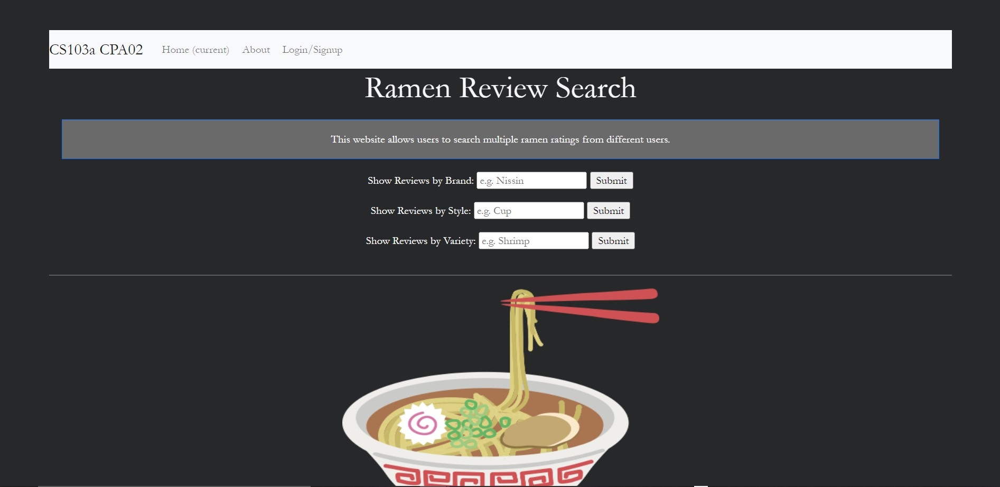
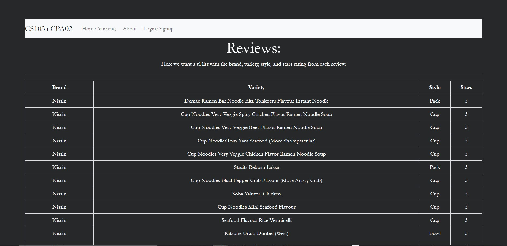

My app allows users to search through a database containing multiple user reviews of various ramen products. Users can search ramen reviews by the brand of the ramen, the style of the ramen, or by the variety of the ramen. When the user searchess through one of these filters, a list of the matching ramen products will be shown, with the brand, variety, style, and stars of the ramen showing for each entry in the list. 

To run the app, users can visit the following heroku link: https://thawing-taiga-73589.herokuapp.com/. The app can also be run using Node.
A video of the app can be found here: https://brandeis.zoom.us/rec/share/cshZYDArhlXWH5VdNWy57ty7aovLSyuYgKQydyLH7aV5bAnxhIIMGMs_DYXAqNTg.F129I3BC3pnyQbBv?startTime=1651596501000
